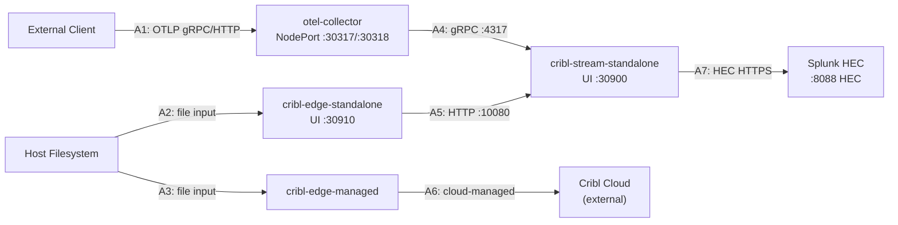

# Architecture: Data Flow and Test Coverage

## Data Flow Diagram

## Test Coverage Map

| Arrow | Path | Test(s) | File |
|-------|------|---------|------|
| A1 | Client → OTEL Collector | `test_send_trace_grpc`, `test_send_trace_http` | test_pipeline.py |
| A2 | Host FS → Edge Standalone | (file mount, verified by pod health) | test_smoke.py |
| A3 | Host FS → Edge Managed | (file mount, verified by pod health) | test_smoke.py |
| A4 | OTEL Collector → Cribl Stream | `test_no_export_errors_after_send`, `test_cribl_stream_received_otlp_data` | test_forwarding.py |
| A5 | Edge Standalone → Cribl Stream | `test_edge_to_stream_connectivity`, `test_cribl_stream_inputs_api_reachable` | test_forwarding.py |
| A6 | Edge Managed → Cribl Cloud | Not locally testable (cloud-managed) | — |
| A7 | Cribl Stream → Splunk HEC | `test_splunk_hec_output_healthy`, `test_splunk_hec_health_endpoint`, `test_splunk_hec_token_accepted`, `test_splunk_hec_url_matches_secret`, `test_cribl_stream_no_output_errors`, `test_cribl_stream_events_flowing` | test_forwarding.py |
